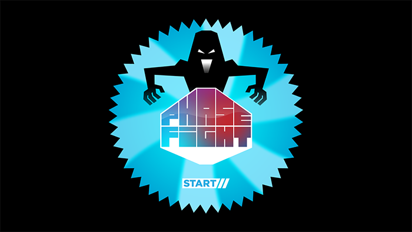

# Graphics Game Jam 2016: Phase Fight

Developed for the Porto Graphics Game Jam 2016, a game development competition between teams of 3-4 elements lasting a total of 32 hours. The theme for the event was **twist**.

> Far out of time or reality, an all mighty being capable of twisting time and reality itself decides to use a bunch of random guys from anytime or anywhere and make them fight to death on a space twisting, gravity bending, time warping arena!

> Control your character on a local multiplayer arena where you can pick up power-ups to twist space, time and gravity to kill your opponent with one of the level’s trap.

The assets utilized in this game may **not** be reproduced, distributed, or used in derivative works.

## Team Members
- Miguel Marques - Artwork
- Hugo Cardoso - Programming
- Ricardo Melo - Sound Design
- Vasco Gomes - Programming

## Screenshots

